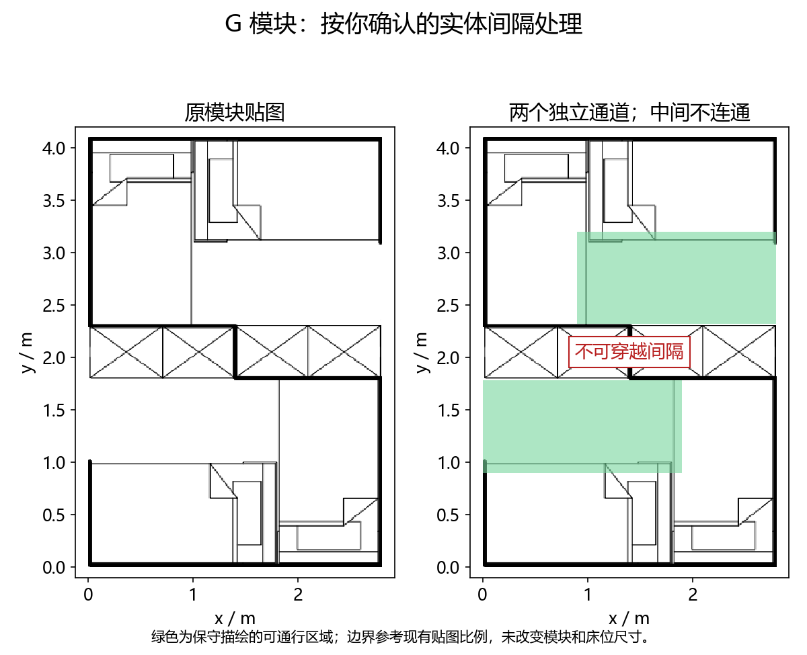
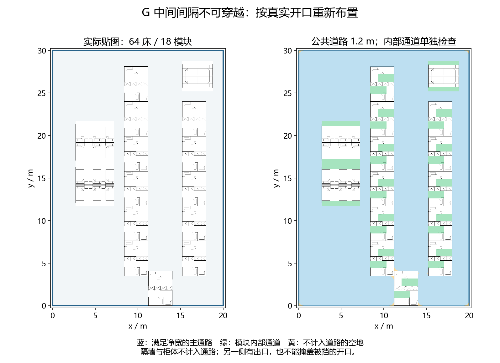

# 0.2.2：零目标组间距、真实开口与公共道路净宽

目标组间距为 0，允许无开口墙面相贴；开口前仍须留出公共道路。
公共道路优先采用 1.2 m；只有该方案未放下全部模块、1.0 m 方案通过检查且能放下更多床位时，才采用 1.0 m，并明确返回降宽提示。
模块内部保留原有较窄通道。选址失败时尝试其他位置、相反开口方向或既有拆分规则，不强行塞入。

## 为什么此前会漏判

此前用“场地减去床位”推测道路，漏掉了墙体和柜体；且把任意场地边缘接触都当作出口。
因此即使一个真实开口被墙挡住，只要别处有绕行路径，旧检查也可能显示通过。
自动推荐还关闭了候选道路过滤，和最终生成采用不同规则，可能误报没有可用组合；本次已统一。

## 当前判定

- 模块外部：从场地扣除整个模块占位，按公共净宽收缩后检查连通，选择能接入场地边界的最大公共道路分区。
- 模块内部：仅配置中的 `road_areas` 可通行，其余区域均不作为通路。G 中间实体间隔不可穿越，上下两个通道分别接入左右侧道路；E 补齐原图已有的上部支路。
- 每个真实开口都须通过检查：朝向场外、贴墙、净宽不足均拒绝。邻接模块只有真正对齐的开口才能直接相通；另一个开口有绕路路径不能抵消此处错误。
- 开口外的道路接入空间须满足所选公共净宽；所有内部通道分区和床位必须接入同一公共道路网络。新增模块不能堵住已有模块。
- 最终审计始终执行。`road_check=False` 仅用于诊断关闭候选过滤，不会伪造成功。

G 通道边界按现有贴图比例保守描绘，中间不可穿越的语义已由用户确认；这些边界不是实测尺寸。
当前仍是贪心布置，不保证最高容纳量。检查没有定义“最大绕行距离/死胡同长度”，不能宣称消除了所有长绕路；也尚未配置指定场地出入口。

## 实际校对图





蓝色为满足公共净宽的主通路，绿色为模块内部通道，黄色为不计入道路的空地。
这两张图替代此前仅检查床位周边连通的示意图。

## 接口与前端

`metrics.road_model` 为 `explicit_aisles_and_public_clearance`；同时提供
`public_road_width_m`、`road_width_reduced`、`road_opening_errors_count`、
`beds_without_road_access_count` 和最终 `road_connected`。
道路区域保留洞边界，来源区分 `walkable`、`module`、`nonroad_open_area`。
小程序明确显示净宽、降宽提示与开口异常；旧服务结果只显示“基础几何通过，尚未校验开口和净宽”。

## 验证

- 35 项 Python 回归，3 项配置预览测试，29 项前端 Node 测试通过。
- 3 项本地端到端用例通过：36 床指定组合、60 床均衡推荐、24 床经济推荐。
- 64 组矩形/凹形/平移混合场地：独立几何检查无越界、重叠或床位计数差异，重新创建道路检查器后的判定一致。道路复查使用同一算法，不是独立道路判定实现。
- D2/G12/C4、20×30 m：64 床、18 模块，公共道路 1.2 m。
- A26/B4/C2/D4、30×45 m：100 床、36 模块，公共道路 1.2 m。
- U 形场地 B4：8 床，采用 1.0 m 降宽方案，相对两侧开口朝向场内。

```text
python -m unittest discover -s 04_test -p "test_*.py"
python 04_test/test_cli_modes.py
node --test 04_test/test_preview_geometry.js
python 04_test/bench_road_connectivity.py --repeats 3
```

缓存仅复用不受新增模块影响的开口和局部几何；有影响时重新检查。
候选试排不计算用于展示的面积/道路序列化，最终输出才计算。逻辑集中在现有道路检查模块，未引入新的框架。

## 本机性能

见 [benchmark.json](release-0.2.2/benchmark.json)。同一进程重复三次取布局中位数，贴图缓存预热，PNG 渲染另计。
不包含冷启动、网络、上传或云端并发；未部署或压测云端。大规模场景仍需等待，不能把本机耗时当作云端响应承诺。

| 场景 | 布局中位数 / 秒 | PNG / 秒 |
| --- | ---: | ---: |
| blocked_64 | 0.3664 | 0.2107 |
| mixed_100 | 0.6478 | 0.2798 |
| B_300 | 9.0273 | 0.5750 |
| G_300 | 8.3499 | 1.6076 |
