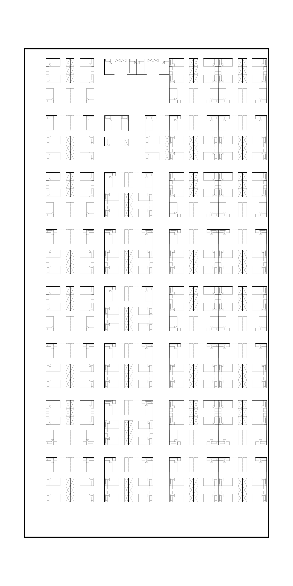

# 0.3.0 — 最终排布整理与推荐、校验加速

所有模块类型和旋转方向均使用实际模块边缘进行最终整理。在已有可行方案上，容量、边界、开口和通路要求先满足，再尽量对齐行列和同侧边缘。整理不拉伸模块，也不降低道路要求。

190 人、30×60 米样例保留 E×61、B×2、F×1，共 190 床、64 模块。中间六个双模块组团沿用左右的行线，消除逐行累计错位；E/F 单模块上边缘同为 y=51.8 米，同时保留侧向开口所需空间。公共道路仍为 1.2 米，完整道路与床边路径校验通过。

整理只在最终生成时运行，推荐预览和购物车数量校验复用快速可行性结果。最终结果单独缓存，返回副本；可选整理异常或耗尽预算时保留原方案且不缓存这次回退。候选数量和搜索状态有限，并设置 5 秒协作预算，单次几何运算无法被强行中断。

本机串行单次测量（不含云端排队、网络、进程启动和渲染）：首次 190 人推荐预览 8.526 秒，B×2/F×62 首次校验 8.039 秒，E×61/B×2/F×1 首次完整排布与整理 3.529 秒，缓存最终排布 0.005 秒。此前本地参考值为推荐 20.914 秒、B×2/F×62 校验 32.522 秒；不构成线上延迟保证。

同时修复毫米精度几何做极小 buffer 时可能误删有效通道的问题。测试确认 1.4 米通道可达，1 毫米实体墙仍不可穿越。

验证：82 项 Python 回归（包含 A–G、两种方向共 14 个整理子场景）、3 项 JavaScript 几何预览、3 个 CLI 端到端场景。测试环境为 Python 3.12、NumPy 2.0.2、Shapely 2.1.2、SciPy 1.16.1；云端依赖版本不同，尚未在云端实测。本次仅发布 Git 代码和标签。

发布包保留环境变量模板；实际部署标识、私有配置、凭据、本地依赖和运行产物不进入版本库。
